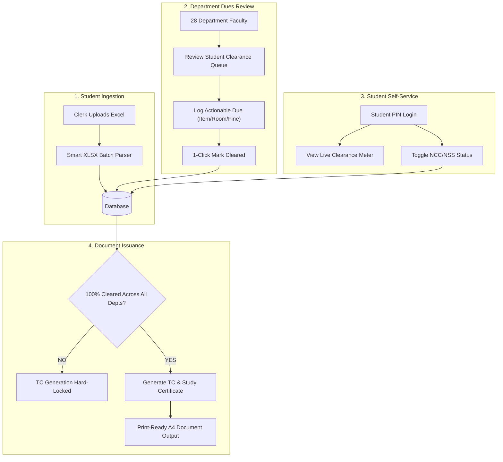

# SVGP No-Dues Clearance & Transfer Certificate Management Portal
## System Architecture, Complete File Inventory & Team Responsibilities Manual

---

## 1. Executive Project Overview

The **SVGP No-Dues Clearance & Transfer Certificate Management Portal** is a production-ready, full-stack enterprise web application engineered specifically for government polytechnic and engineering institutions. 

It completely digitizes and automates the traditional, cumbersome paper-based no-dues circular clearance workflow across **28 institutional departments and laboratories**, enabling frictionless online clearance verification, administrative automation, and the automated generation of tamper-proof **Transfer Certificates (TC)** and **Study & Conduct Certificates**.

---

## 2. Comprehensive System Features & Capabilities

### 🎓 A. Student Self-Service Module
* **Frictionless Passwordless Login:** Instant authentication using Student PIN (e.g., `21001-CM-001`) and registered student name verification, eliminating password recovery issues for graduating batches.
* **Real-Time Visual Clearance Meter:** Interactive progress bar dynamically calculating the percentage of cleared departments vs. pending dues.
* **Actionable Dues Breakdown:** Transparent itemized view displaying which departments have pending dues, including specific item details, required fine amounts, and physical room/lab locations.
* **NCC / NSS Cadet Declaration Switch:** Interactive toggle allowing students to declare cadet affiliation, dynamically adding the NCC/NSS Officer to their required clearance approval chain.
* **Notification Request Engine:** Rate-limited clearance notification button allowing students to alert pending departments when physical clearance has been submitted.

### 🏛️ B. Clerk & Administration Module
* **Master Student Directory Management:** Comprehensive CRUD operations for viewing, filtering, searching, and managing student profiles across diploma branches (CME, EEE, ECE, MECH, CIVIL, AUTOMOBILE, etc.).
* **Smart Excel (XLSX) Batch Ingestion Engine:** High-performance spreadsheet parser built on SheetJS that validates incoming data, maps custom column headers, checks for duplicate PINs, ignores extraneous columns safely, and bulk-inserts hundreds of student records within a single database transaction.
* **Faculty & Department Management:** Ability to create and manage faculty accounts, assigning them to either **Universal/Common Departments** (Central Library, Physical Education, Hostel, Examination Cell) or **Branch-Specific Labs** (Computer Networks Lab, Heat Power Lab, Survey Lab).
* **Certificate Issuance & Physical Collection Tracking:** Dedicated administrative log to mark generated certificates as physically handed over, recording collection timestamps and student acknowledgements.

### 🏢 C. Faculty & Department Dues Management Module
* **Role-Scoped Clearance Review Queues:** Multi-department isolation ensuring faculty members can only view and modify dues belonging strictly to their assigned `department_id`.
* **Actionable Free-Text Due Logging:** Ability to log clear, descriptive dues (e.g., *"Return Lathe Cutting Tool #4 to Workshop Room 102 & pay ₹120 overdue fine"*).
* **1-Click Clearance Resolution:** Rapid clearance toggle that updates the database record instantly and refreshes the student's personal progress meter.
* **Batch Clearance Approvals:** Bulk-approval capability for fast-tracking graduating batches with zero dues.

### 📄 D. Document Generation & Verification Engine
* **Hard Database Clearance Locking:** Server-enforced integrity constraint preventing the issuance of Transfer Certificates if even a single department or lab due remains in `PENDING` status.
* **Official Transfer Certificate (TC) Generation:** Automatically populates institutional data, admission year, completion year, conduct, and unique serial numbers formatted to official state technical board (SBTET) standards.
* **Official Study & Conduct Certificate Generation:** Coordinated generation of institutional conduct certificates populated with student academic records.
* **Multi-Version Tracking:** Full audit history and version incrementing (`v1` original, `v2`/`v3` duplicate re-issues) for lost certificates.
* **Government-Standard Print CSS Optimization:** Specialized `@media print` stylesheets formatting certificates perfectly for standard A4 paper with institutional borders, emblems, and signature blocks without website clutter.

### 🛡️ E. Security & System Reliability
* **Stateless JWT Authentication:** Secure session management using cryptographically signed JSON Web Tokens.
* **Bcrypt Password Hashing:** Salted password encryption protecting all administrative and faculty accounts.
* **Role-Based Authorization Middleware:** Intercepts every API route to enforce strict permission boundaries (`Clerk/Admin`, `Faculty`, `Student`).
* **20-Hour Anti-Spam Rate Limiting:** Backend rate limiter preventing students from repeatedly spamming faculty inboxes with clearance requests.
* **Dual-Database Abstraction Engine:** Seamless dynamic switching between embedded **SQLite** (for zero-setup local/offline execution) and **PostgreSQL on Supabase** (for cloud production hosting).

---

## 3. Complete Project Directory & File Structure

```
svgptc-management-portal/
├── .github/
│   └── workflows/
│       └── keep-alive.yml          # Automated GitHub Actions uptime pinger
├── backend/
│   ├── src/
│   │   ├── config/
│   │   │   ├── db.js               # Dual-Database abstraction (SQLite / PostgreSQL)
│   │   │   └── seedData.js         # Initial master departments & demo accounts
│   │   ├── controllers/
│   │   │   ├── authController.js   # Login, password hashing & JWT token issuance
│   │   │   ├── certificateController.js # TC & Study certificate locking & generation
│   │   │   ├── clerkController.js  # Student CRUD, batch Excel processing & accounts
│   │   │   ├── facultyController.js# Department dues review, logging & clearance
│   │   │   └── studentController.js# Student dashboard, dues lookup & cadet toggle
│   │   ├── middleware/
│   │   │   └── authMiddleware.js   # JWT verification & Role-Based Access Control
│   │   ├── routes/
│   │   │   ├── authRoutes.js       # Auth API route definitions
│   │   │   ├── branchRoutes.js     # Diploma branch listing endpoints
│   │   │   ├── certificateRoutes.js# Certificate generation & issuance endpoints
│   │   │   ├── clerkRoutes.js      # Admin/Clerk management endpoints
│   │   │   ├── departmentRoutes.js # Institutional department list endpoints
│   │   │   ├── facultyRoutes.js    # Faculty review & dues clearance endpoints
│   │   │   └── studentRoutes.js    # Student self-service endpoints
│   │   ├── utils/
│   │   │   ├── excelValidator.js   # SheetJS spreadsheet parser & validator
│   │   │   └── helpers.js          # Reusable formatting, dates & helper routines
│   │   └── server.js               # Express application entry point & API mount
│   ├── tests/
│   │   ├── branches.test.js        # Branch isolation unit tests
│   │   ├── e2e.test.js             # 29 End-to-End full workflow integration tests
│   │   ├── librarians.test.js      # Multi-department clearance test suite
│   │   └── svgp_features.test.js   # Business logic & rate limiter tests
│   ├── .env.example                # Template for environment configuration
│   ├── database.sqlite             # Local zero-configuration database file
│   └── package.json                # Backend dependencies & test scripts
├── frontend/
│   ├── assets/                     # Institutional logos, stamps & emblems
│   ├── css/
│   │   └── style.css               # Responsive design system & @media print styles
│   ├── js/
│   │   ├── api.js                  # Centralized fetch wrapper & JWT interceptor
│   │   ├── certificate.js          # TC & Conduct certificate preview/print logic
│   │   ├── clerk.js                # Clerk dashboard UI logic & Excel upload
│   │   ├── config.js               # Frontend API base URL configuration
│   │   ├── faculty.js              # Faculty clearance queues & dues logging UI
│   │   └── student.js              # Student progress meter & cadet switch UI
│   ├── 404.html                    # User-friendly page not found fallback
│   ├── certificate-view.html       # Print-optimized certificate preview template
│   ├── clerk.html                  # Clerk Administration Dashboard
│   ├── faculty.html                # Department Clearance Faculty Portal
│   ├── index.html                  # Main landing page & multi-role login
│   └── student.html                # Student Self-Service Dashboard
├── sample_students_import.xlsx     # Standard student bulk import template
├── SRS.docx                        # Formal Software Requirements Specification
└── README.md                       # Repository overview & quickstart guide
```

---

## 4. In-Depth File & Folder Inventory (Why Every File Exists)

### 📁 Root Configuration & Documentation
* **`README.md`**: The primary open-source guide providing installation steps, API documentation, environment variable setups, and test execution commands.
* **`SRS.docx`**: The formal Software Requirements Specification document detailing institutional functional and non-functional requirements, data dictionary, and SBTET compliance.
* **`sample_students_import.xlsx`**: Standardized Microsoft Excel spreadsheet template pre-formatted with PIN, Name, Father's Name, Branch, and Admission Year for clerk testing.
* **`.github/workflows/keep-alive.yml`**: Continuous integration workflow running on a scheduled cron trigger to keep the cloud deployment active and prevent free-tier container sleep.

---

### 📁 Backend Architecture (`/backend`)

#### 📂 `backend/src/config/`
* **`db.js`**: **Dual-Database Abstraction Layer.** Checks for the presence of `DATABASE_URL`. If present, it establishes a high-performance connection pool to **PostgreSQL (Supabase)**. If absent, it automatically initialises local **SQLite** (`better-sqlite3`), creating all tables and relational indexes automatically.
* **`seedData.js`**: Database seeder that initializes the 28 standard polytechnic departments, branches (CME, EEE, MECH, CIVIL, etc.), and default administrative accounts upon initial launch.

#### 📂 `backend/src/controllers/`
* **`authController.js`**: Handles user authentication across all roles (Clerk, Faculty, Student). Manages password verification with Bcrypt and signs stateless JWT tokens with role claims.
* **`certificateController.js`**: Enforces the hard 100% no-dues clearance verification rule, generates unique serial numbers, tracks re-issuance versions (`v1`, `v2`), and formats certificate data.
* **`clerkController.js`**: Handles administrative logic including student profile CRUD, dynamic faculty-department mapping, and streaming the Excel bulk import.
* **`facultyController.js`**: Manages department review queues, free-text actionable dues logging, and single-click clearance toggles scoped to the faculty's department ID.
* **`studentController.js`**: Serves student clearance status, parses itemized dues remarks, handles cadet status toggling, and calculates clearance percentages.

#### 📂 `backend/src/middleware/`
* **`authMiddleware.js`**: Security gatekeeper intercepting HTTP requests. Verifies JWT token signatures from the `Authorization: Bearer` header and checks user role permissions before granting access to protected routes.

#### 📂 `backend/src/routes/`
* **`authRoutes.js`**: Defines routes for `/api/auth/login`, `/api/auth/me`, and session validation.
* **`branchRoutes.js`**: Defines routes for querying the active institutional diploma branches.
* **`certificateRoutes.js`**: Defines routes for `/api/certificates/generate`, `/api/certificates/history`, and `/api/certificates/status`.
* **`clerkRoutes.js`**: Defines administrative routes for Excel uploads, student records, and faculty management.
* **`departmentRoutes.js`**: Defines routes for listing the 28 institutional departments and their branch scopes.
* **`facultyRoutes.js`**: Defines routes for `/api/faculty/students`, `/api/faculty/dues/add`, and `/api/faculty/dues/clear`.
* **`studentRoutes.js`**: Defines routes for `/api/student/profile`, `/api/student/dues`, and `/api/student/cadet-toggle`.

#### 📂 `backend/src/utils/`
* **`excelValidator.js`**: Reads multi-format Excel spreadsheets using SheetJS (`xlsx`), maps varying column headers (e.g. `Pin No`, `PIN`, `Student PIN`), validates mandatory fields, and strips invalid data.
* **`helpers.js`**: Reusable utility functions for date formatting, serial number hashing, and response normalization.

#### 📂 `backend/tests/`
* **`e2e.test.js`**: Comprehensive End-to-End automated test suite with **29/29 passing test specifications**, verifying every user journey from student upload to final TC issuance.
* **`branches.test.js`**, **`librarians.test.js`**, **`svgp_features.test.js`**: Specialized unit tests verifying branch scoping, multi-department clearances, and the 20-hour rate limiter.

---

### 📁 Frontend Architecture (`/frontend`)

* **`index.html`**: The unified entry point offering multi-role access (Clerk, Faculty, Student) with clean card-based navigation.
* **`clerk.html` & `js/clerk.js`**: The administrative console featuring student directory search, batch Excel upload drag-and-drop, faculty account provisioning, and certificate issuance status.
* **`faculty.html` & `js/faculty.js`**: The department portal displaying filtered clearance queues, modal dialogs for logging itemized dues with room numbers, and one-click resolution controls.
* **`student.html` & `js/student.js`**: The student dashboard featuring passwordless PIN login, real-time animated clearance progress bar, NCC/NSS cadet switch, and itemized dues remarks.
* **`certificate-view.html` & `js/certificate.js`**: The official document render template that dynamically populates both the **Transfer Certificate** and **Study & Conduct Certificate**, equipped with A4 print CSS formatting.
* **`css/style.css`**: The central design system containing responsive CSS Grid/Flexbox layouts, dark/light theme variables, and `@media print` rules for paper output.
* **`js/api.js`**: The centralized frontend HTTP service that automatically attaches JWT tokens to requests, intercepts 401/403 errors, and normalizes API error handling.
* **`js/config.js`**: Environment configuration file providing the backend API URL across local and deployed environments.

---

## 5. Team Member Roles & Technical Responsibilities

---

### 👤 Member: Keerthan (Team Lead)
#### 🏷️ Domain: Backend Core Architecture & Transfer Certificate Engine
* **Core Modules Owned:**
  * Backend API controllers (`certificateController.js`, `server.js`).
  * Hard Clearance Verification & TC Locking Algorithm.
  * Unique Sequential Serial Number Generator.
  * Multi-Version Certificate History & Audit Logging (`v1` original, `v2` duplicate).
* **Technical Highlights:**
  * Enforced server-side database integrity: certificate issuance is rejected at the SQL level if `status != 'CLEARED'` across any of the 28 departments.
  * Built database transactional locks ensuring every generated certificate receives a unique, non-colliding serial number.
  * Developed versioning logic allowing colleges to safely re-issue lost certificates with duplicate version tracking.

---

### 👤 Member: Likith
#### 🏷️ Domain: Clerk Administration & Smart Excel Ingestion Engine
* **Core Modules Owned:**
  * Clerk Administration Dashboard (`clerk.html`, `js/clerk.js`).
  * Smart Excel Spreadsheet Batch Parser (`excelValidator.js`, `clerkController.js`).
  * Master Student Directory CRUD database queries.
  * Authentication Security Layer (Bcrypt password hashing & JWT token validation).
* **Technical Highlights:**
  * Integrated SheetJS (`xlsx`) engine capable of parsing diverse institutional spreadsheet formats, sanitizing column headers, and validating PIN records.
  * Implemented atomic batch database transactions allowing hundreds of student records to be ingested in seconds without partial failure.
  * Built salted password encryption with Bcrypt and role-based authorization middleware.

---

### 👤 Member: Khalid
#### 🏷️ Domain: Faculty Dashboard & Department Dues Management
* **Core Modules Owned:**
  * Faculty Clearance Portal (`faculty.html`, `js/faculty.js`).
  * 28 Department/Laboratory Clearance Queues (`facultyController.js`).
  * Actionable Free-Text Due Logging Engine.
  * 1-Click Clearance Resolution Workflow.
* **Technical Highlights:**
  * Implemented Department-Level Data Isolation: faculty logins are strictly scoped to their assigned `department_id`.
  * Designed the actionable free-text logging interface, enabling faculty to specify exact item names, fine amounts, and physical laboratory room numbers.
  * Built real-time clearance resolution controls that immediately update student statuses across the entire portal.

---

### 👤 Member: Hema Teja
#### 🏷️ Domain: Student Self-Service Portal & UI/UX Design
* **Core Modules Owned:**
  * Student Portal Interface (`student.html`, `js/student.js`).
  * Passwordless PIN & Name Matching Authentication.
  * Real-Time Animated Clearance Progress Meter.
  * NCC / NSS Cadet Declaration Switch.
  * Responsive CSS Theme Engine (`style.css`).
* **Technical Highlights:**
  * Created a frictionless passwordless authentication system matching student PINs and names, preventing forgotten password lockouts during graduation.
  * Engineered a dynamic visual clearance progress meter that computes real-time clearance percentage.
  * Built the NCC/NSS cadet declaration toggle that dynamically inserts cadet officers into the student's approval chain.

---

### 👤 Member: Bhargav
#### 🏷️ Domain: Study & Conduct Certificate Engine & Print Formatting Lead
* **Core Modules Owned:**
  * Study & Conduct Certificate Generation Module (`certificateController.js`, `certificate-view.html`).
  * Print-Optimized CSS Stylesheet Engine (`style.css`).
  * Dual Certificate Generation Preview (`js/certificate.js`).
* **Technical Highlights:**
  * Developed the automated Study & Conduct Certificate generator, pulling dynamic student academic data into official SBTET formats.
  * Engineered pixel-perfect `@media print` stylesheets with explicit `size: A4 portrait`, suppressing browser UI clutter and aligning institutional emblems.
  * Integrated dual certificate preview capabilities allowing clerks to preview and print both the TC and Study Certificate in one seamless workflow.

---

## 6. End-to-End System Workflow Diagram


